# EmbarkX Architecture - Mermaid Diagrams

Complete architecture diagrams using Mermaid syntax for GitHub and documentation.

---

## 1. Overall System Architecture

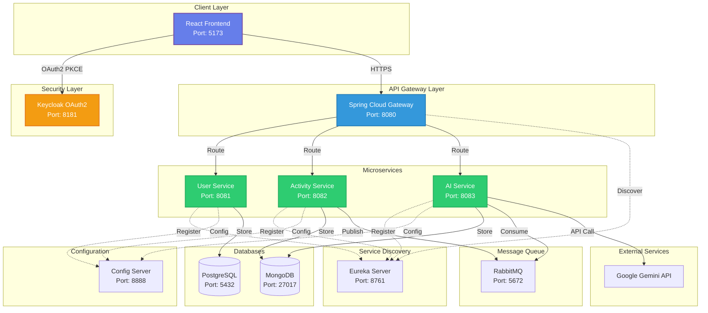

---

## 2. Microservices Architecture Detailed

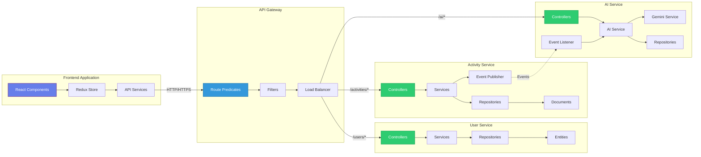

---

## 3. OAuth2 Authentication Flow

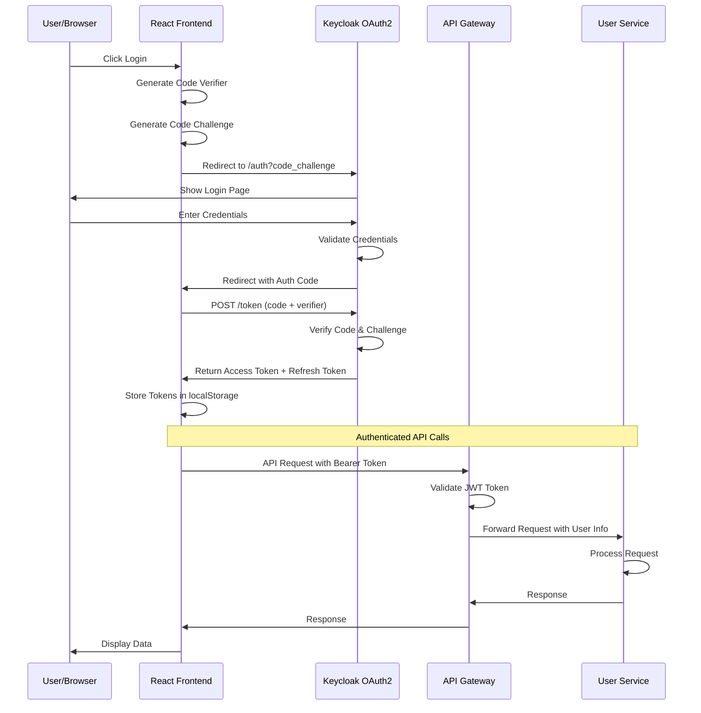

---

## 4. Activity Creation Flow

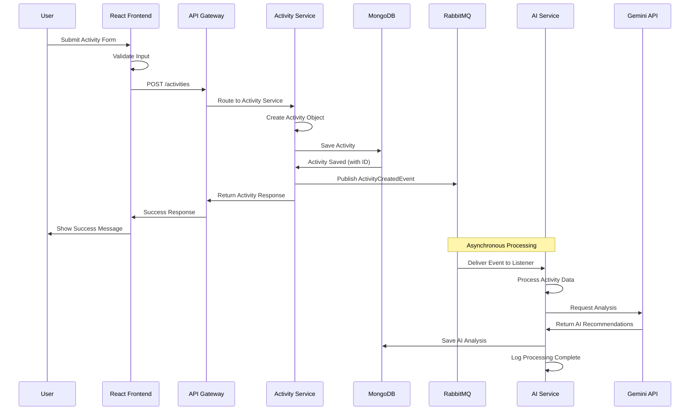

---

## 5. Service Discovery Flow

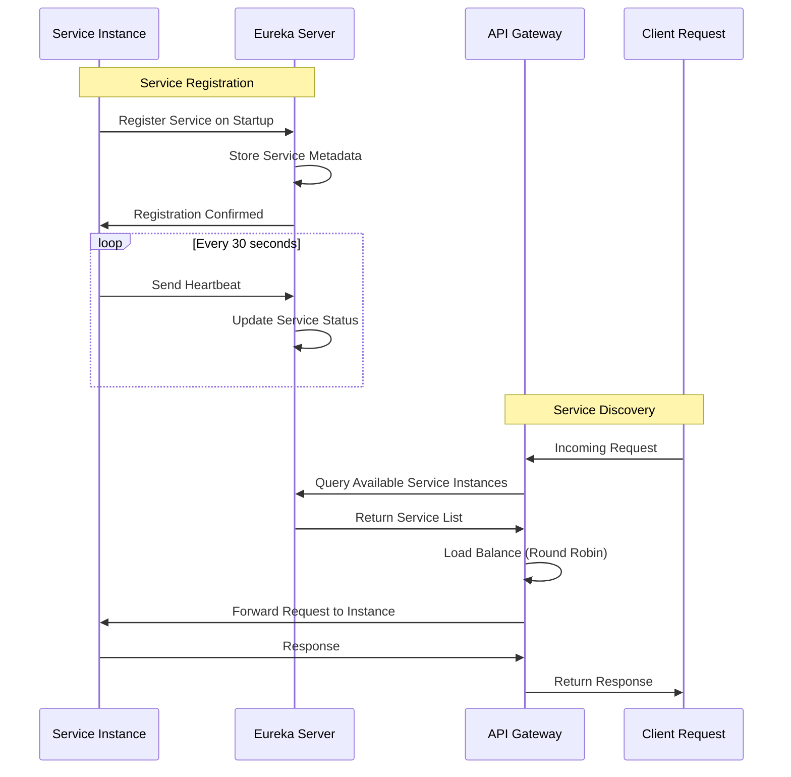

---

## 6. Component Architecture Diagram

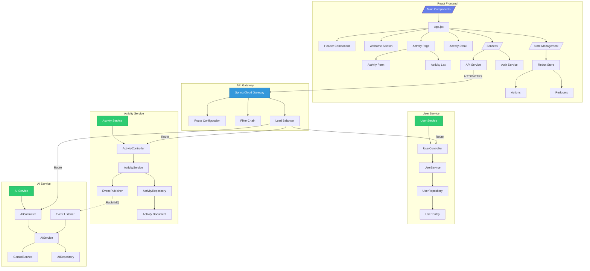

---

## 7. Data Flow Diagram

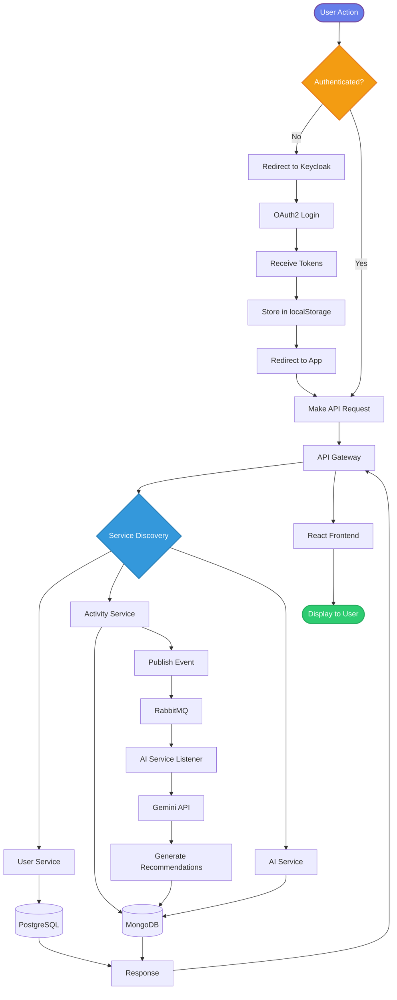

---

## 8. Deployment Architecture

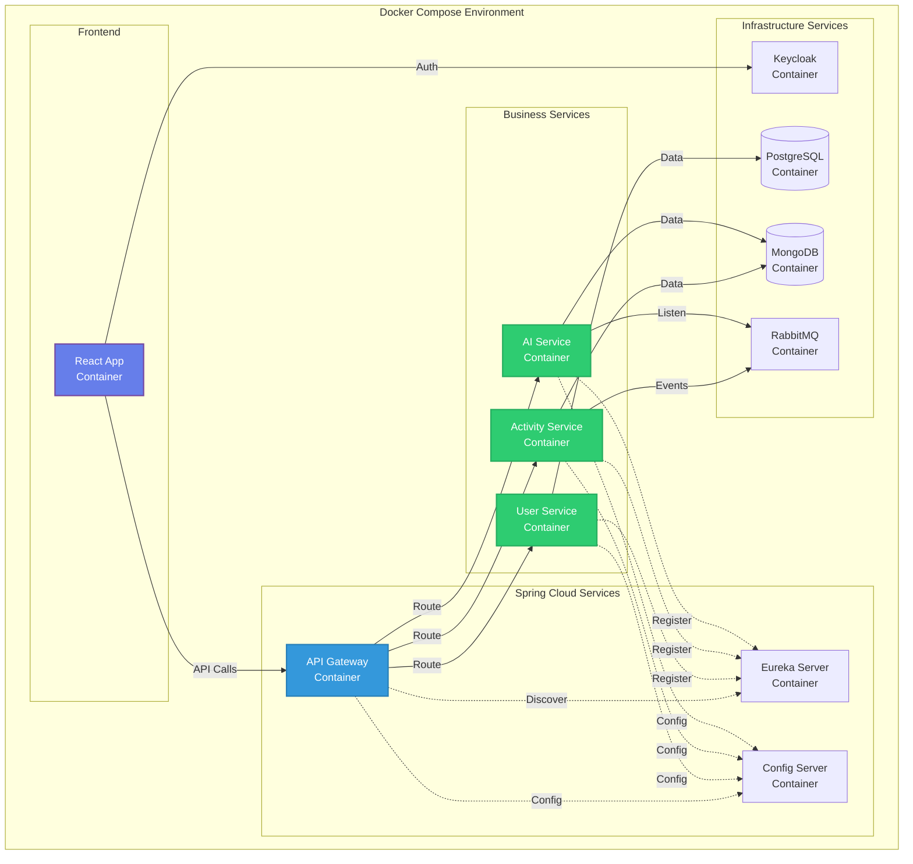

---

## 9. Database Schema Diagram

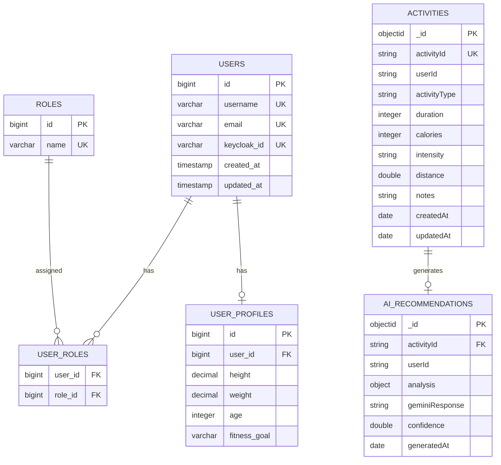

---

## 10. Security Architecture

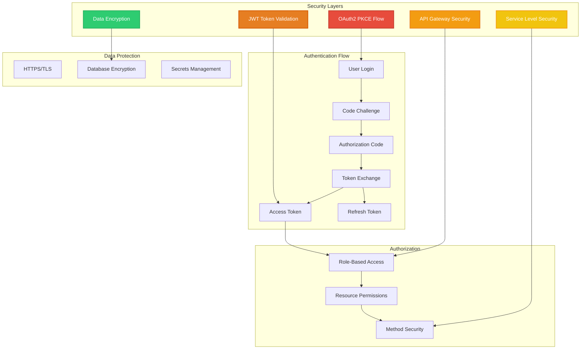

---

## 11. Event-Driven Architecture

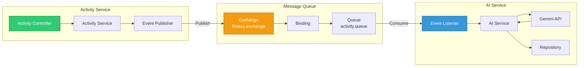

---

## 12. CI/CD Pipeline

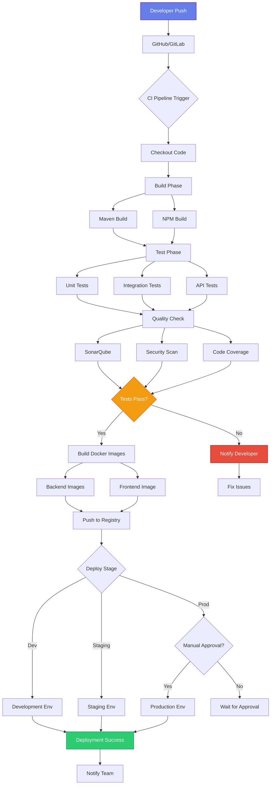

---

## 13. Monitoring & Observability

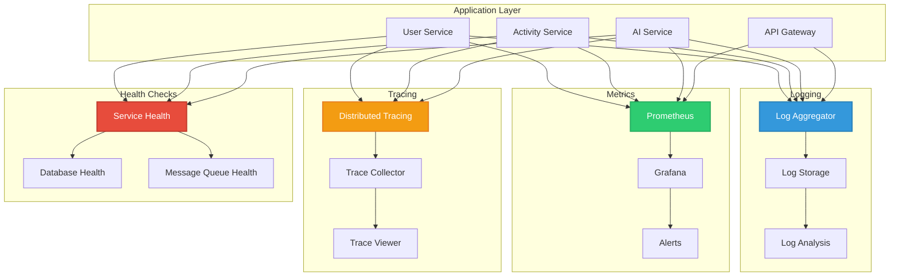

---

## How to Use These Diagrams

### **In GitHub README:**
Simply paste the Mermaid code blocks into your README.md file, and GitHub will automatically render them.

### **In VS Code:**
Install the "Markdown Preview Mermaid Support" extension to preview diagrams.

### **Online Editors:**
- [Mermaid Live Editor](https://mermaid.live/)
- Copy and paste any diagram to edit and export

### **In Documentation:**
Most modern documentation tools (GitBook, Docusaurus, MkDocs) support Mermaid diagrams natively.

---

## Diagram Legend

**Colors Used:**
- 🟦 **Blue** (#3498db): Gateway, Infrastructure
- 🟩 **Green** (#2ecc71): Microservices, Success
- 🟪 **Purple** (#667eea): Frontend, Client
- 🟧 **Orange** (#f39c12): Security, Message Queue
- 🟥 **Red** (#e74c3c): Errors, Critical

**Arrow Types:**
- **Solid (→)**: Direct communication/call
- **Dotted (-.->)**: Service discovery/registration
- **Bold (==>)**: Main data flow

---

## Export Options

You can export these diagrams as:
- PNG/SVG images (using Mermaid Live Editor)
- PDF (for documentation)
- Embedded in HTML
- Included in Confluence/Notion

---

**Generated for EmbarkX AI Microservice Fitness Application**
**Date:** December 24, 2025
**Architecture Version:** 1.0
