# EmbarkX - Complete System Architecture

## Single Comprehensive Architecture Diagram

This diagram represents the complete EmbarkX AI-Powered Fitness Tracking Platform architecture in a single view.

```mermaid
graph TB
    subgraph "CLIENT LAYER"
        USER[👤 User Browser]
        FRONTEND[React Frontend<br/>Port: 5173<br/>Material-UI + Redux]
        USER --> FRONTEND
    end
    
    subgraph "SECURITY LAYER"
        KEYCLOAK[🔐 Keycloak OAuth2<br/>Port: 8181<br/>JWT Token Management]
    end
    
    subgraph "API GATEWAY LAYER"
        GATEWAY[Spring Cloud Gateway<br/>Port: 8080<br/>Routing + Load Balancing]
        EUREKA[🎯 Eureka Discovery<br/>Port: 8761<br/>Service Registry]
        CONFIG[⚙️ Config Server<br/>Port: 8888<br/>Configuration]
    end
    
    subgraph "MICROSERVICES LAYER"
        USER_SERVICE[User Service<br/>Port: 8081<br/>User Management]
        ACTIVITY_SERVICE[Activity Service<br/>Port: 8082<br/>Workout Tracking]
        AI_SERVICE[AI Service<br/>Port: 8083<br/>AI Recommendations]
    end
    
    subgraph "MESSAGE LAYER"
        RABBITMQ[🐰 RabbitMQ<br/>Port: 5672<br/>Event Processing]
    end
    
    subgraph "DATABASE LAYER"
        POSTGRES[(PostgreSQL<br/>Port: 5432<br/>User Data)]
        MONGODB[(MongoDB<br/>Port: 27017<br/>Activities & AI Data)]
    end
    
    subgraph "EXTERNAL API"
        GEMINI[🤖 Google Gemini<br/>AI Analysis API]
    end
    
    %% Main Flow
    FRONTEND -->|1. Login Request| KEYCLOAK
    KEYCLOAK -->|2. JWT Token| FRONTEND
    FRONTEND -->|3. API Calls| GATEWAY
    
    %% Gateway to Services
    GATEWAY -->|4. Route| USER_SERVICE
    GATEWAY -->|4. Route| ACTIVITY_SERVICE
    GATEWAY -->|4. Route| AI_SERVICE
    
    %% Service Discovery
    USER_SERVICE -.->|Register| EUREKA
    ACTIVITY_SERVICE -.->|Register| EUREKA
    AI_SERVICE -.->|Register| EUREKA
    GATEWAY -.->|Discover| EUREKA
    
    %% Configuration
    GATEWAY -.->|Config| CONFIG
    USER_SERVICE -.->|Config| CONFIG
    ACTIVITY_SERVICE -.->|Config| CONFIG
    AI_SERVICE -.->|Config| CONFIG
    
    %% Data Storage
    USER_SERVICE -->|5. CRUD| POSTGRES
    ACTIVITY_SERVICE -->|6. Store| MONGODB
    AI_SERVICE -->|7. Store| MONGODB
    
    %% Event Processing
    ACTIVITY_SERVICE -->|8. Publish Event| RABBITMQ
    RABBITMQ -->|9. Consume Event| AI_SERVICE
    
    %% AI Integration
    AI_SERVICE -->|10. Analyze| GEMINI
    GEMINI -->|11. Recommendations| AI_SERVICE
    
    %% Response Flow
    USER_SERVICE -.->|Response| GATEWAY
    ACTIVITY_SERVICE -.->|Response| GATEWAY
    AI_SERVICE -.->|Response| GATEWAY
    GATEWAY -.->|12. JSON Response| FRONTEND
    FRONTEND -.->|13. Update UI| USER
    
    %% Styling
    classDef frontend fill:#667eea,stroke:#764ba2,stroke-width:3px,color:#fff
    classDef security fill:#e74c3c,stroke:#c0392b,stroke-width:3px,color:#fff
    classDef gateway fill:#3498db,stroke:#2980b9,stroke-width:3px,color:#fff
    classDef service fill:#2ecc71,stroke:#27ae60,stroke-width:3px,color:#fff
    classDef message fill:#f39c12,stroke:#e67e22,stroke-width:3px,color:#fff
    classDef database fill:#9b59b6,stroke:#8e44ad,stroke-width:3px,color:#fff
    classDef external fill:#34495e,stroke:#2c3e50,stroke-width:3px,color:#fff
    
    class USER,FRONTEND frontend
    class KEYCLOAK security
    class GATEWAY,EUREKA,CONFIG gateway
    class USER_SERVICE,ACTIVITY_SERVICE,AI_SERVICE service
    class RABBITMQ message
    class POSTGRES,MONGODB database
    class GEMINI external
```



---

## Architecture Flow Description

### **Complete Request-Response Cycle:**

#### **Phase 1: Authentication (Steps 1-4)**
1. User initiates login through React frontend
2. Keycloak OAuth2 returns authorization code
3. Frontend exchanges code for tokens using PKCE
4. JWT tokens stored in localStorage

#### **Phase 2: API Request (Steps 5-6)**
5. User action triggers API call with Bearer token
6. API Gateway routes request to appropriate microservice:
   - `/users/*` → User Service (Port 8081)
   - `/activities/*` → Activity Service (Port 8082)
   - `/ai/*` → AI Service (Port 8083)

#### **Phase 3: Data Processing (Steps 7-8)**
7. Microservices interact with databases:
   - User Service → PostgreSQL (relational data)
   - Activity Service → MongoDB (document storage)
   - AI Service → MongoDB (recommendations)
8. Activity Service publishes events to RabbitMQ

#### **Phase 4: AI Processing (Steps 9-11)**
9. AI Service consumes events from message queue
10. Gemini API analyzes workout data
11. AI recommendations stored in MongoDB

#### **Phase 5: Response (Steps 12-14)**
12. Gateway forwards response to frontend
13. Redux updates application state
14. Components re-render with new data

---

## Key Architecture Features

### **🎯 Microservices Pattern**
- **Service Independence**: Each service can be deployed separately
- **Technology Flexibility**: Different databases per service
- **Scalability**: Horizontal scaling capability

### **🔐 Security**
- **OAuth2 PKCE**: Most secure flow for SPAs
- **JWT Tokens**: Stateless authentication
- **API Gateway**: Centralized security enforcement

### **🚀 Performance**
- **Load Balancing**: Round-robin distribution
- **Service Discovery**: Dynamic service location
- **Event-Driven**: Asynchronous processing

### **📊 Data Management**
- **Polyglot Persistence**: PostgreSQL + MongoDB
- **Event Sourcing**: RabbitMQ messaging
- **Data Consistency**: ACID (PostgreSQL) + BASE (MongoDB)

### **🤖 AI Integration**
- **Google Gemini**: Advanced AI analysis
- **Asynchronous Processing**: Non-blocking operations
- **Recommendation Engine**: Personalized insights

---

## Technology Stack

| Layer | Technology | Version | Port |
|-------|-----------|---------|------|
| **Frontend** | React | 19.2.0 | 5173 |
| | Vite | 7.2.4 | - |
| | Material-UI | 7.3.6 | - |
| | Redux Toolkit | 2.11.1 | - |
| **Security** | Keycloak | 23+ | 8181 |
| **Gateway** | Spring Cloud Gateway | 4.1.0 | 8080 |
| **Discovery** | Eureka Server | 4.1.0 | 8761 |
| **Config** | Config Server | 4.1.0 | 8888 |
| **Services** | Spring Boot | 3.5.8 | 8081-8083 |
| | Java | 21 | - |
| **Messaging** | RabbitMQ | 3.12+ | 5672 |
| **Databases** | PostgreSQL | 15+ | 5432 |
| | MongoDB | 6.0+ | 27017 |
| **AI** | Google Gemini | 2.0 | - |

---

## Deployment Architecture

```
┌─────────────────────────────────────────────────────┐
│              Docker Compose Environment              │
├─────────────────────────────────────────────────────┤
│                                                       │
│  Infrastructure:                                     │
│  ├─ PostgreSQL Container (5432)                     │
│  ├─ MongoDB Container (27017)                       │
│  ├─ RabbitMQ Container (5672)                       │
│  └─ Keycloak Container (8181)                       │
│                                                       │
│  Spring Cloud:                                       │
│  ├─ Eureka Server (8761)                            │
│  ├─ Config Server (8888)                            │
│  └─ API Gateway (8080)                              │
│                                                       │
│  Microservices:                                      │
│  ├─ User Service (8081)                             │
│  ├─ Activity Service (8082)                         │
│  └─ AI Service (8083)                               │
│                                                       │
│  Frontend:                                           │
│  └─ React Application (5173)                        │
│                                                       │
└─────────────────────────────────────────────────────┘
```

---

## Architecture Highlights

### ✨ **Scalability**
- Each microservice can scale independently
- Load balancing across multiple instances
- Horizontal scaling support

### ✨ **Resilience**
- Service discovery for failover
- Circuit breaker pattern (future)
- Health monitoring

### ✨ **Maintainability**
- Clear separation of concerns
- Centralized configuration
- Standardized API patterns

### ✨ **Security**
- OAuth2 PKCE flow
- JWT token validation
- Encrypted communication

### ✨ **Performance**
- Asynchronous event processing
- Database optimization
- Caching strategies (future)

---

## How to Use This Diagram

### **For GitHub/Documentation:**
Copy the Mermaid code into your README.md or documentation files. GitHub and most modern documentation platforms will render it automatically.

### **For Presentations:**
1. Open [Mermaid Live Editor](https://mermaid.live/)
2. Paste the code
3. Export as PNG/SVG
4. Use in PowerPoint/Google Slides

### **For VS Code:**
Install "Markdown Preview Mermaid Support" extension to preview directly in VS Code.

### **For LinkedIn:**
Export as image and upload to your project section with the architecture description.

---

## Legend

**Line Types:**
- **Solid Arrow (==>)**: Main data flow / API calls
- **Dotted Arrow (-.->)**: Service registration / configuration / responses
- **Thick Lines**: Primary communication paths

**Colors:**
- 🟪 **Purple**: Client/Frontend Layer
- 🟥 **Red**: Security/Authentication
- 🟦 **Blue**: API Gateway & Infrastructure
- 🟩 **Green**: Microservices
- 🟧 **Orange**: Message Queue
- 🟣 **Dark Purple**: Databases
- ⬛ **Dark Gray**: External Services

**Icons:**
- 👤 User/Browser
- 🔐 Security/Authentication
- 🎯 Service Discovery
- ⚙️ Configuration
- 🐰 Message Queue
- 🐘 PostgreSQL
- 🍃 MongoDB
- 🤖 AI Service

---

## Project Information

**Project Name:** EmbarkX - AI-Powered Fitness Tracking Platform  
**Architecture Type:** Microservices with Event-Driven Processing  
**Version:** 1.0  
**Date:** December 24, 2025  
**Author:** [Your Name]  

---

**This single diagram provides a complete overview of the entire system architecture, showing all components, their interactions, and the complete data flow from user action to AI-powered response.**
