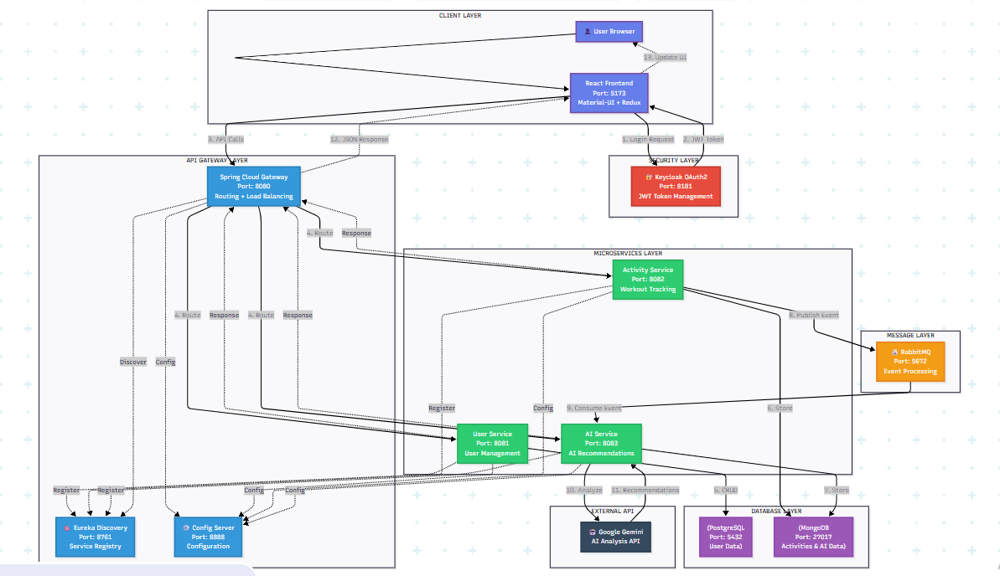

# 🏋️ EmbarkX - AI-Powered Microservice Fitness Application

[](https://www.oracle.com/java/)
[](https://spring.io/projects/spring-boot)
[](https://react.dev/)
[](https://www.docker.com/)
[](LICENSE)

**EmbarkX** is an enterprise-grade fitness tracking platform built on a cloud-native microservices architecture. It combines real-time activity logging with **Google Gemini AI** to provide personalized workout analysis, safety tips, and performance recommendations.

---

## 🏗️ System Architecture

The application is composed of **6 distributed microservices** orchestrated by Netflix Eureka and communicating via a mix of synchronous REST APIs (OpenFeign) and asynchronous events (RabbitMQ).



### Microservices Breakdown

| Service | Port | Description |
| :--- | :--- | :--- |
| **Eureka Server** | `8761` | Service Discovery & Registry |
| **Config Server** | `8888` | Centralized Configuration Management |
| **API Gateway** | `8080` | Entry point, Routing, Load Balancing, Security |
| **User Service** | `8081` | Identity Management (PostgreSQL) |
| **Activity Service** | `8082` | Workout Tracking & Event Publishing (MongoDB) |
| **AI Service** | `8083` | Gemini Integration & Recommendations (MongoDB) |
| **Frontend** | `5173` | React 19 Single Page Application |

---

## 🚀 Key Features

* **Microservices Architecture:** Independently deployable services using Spring Cloud.
* **Event-Driven Design:** Asynchronous processing using **RabbitMQ** to decouple activity logging from AI analysis.
* **AI-Powered Insights:** Integration with **Google Gemini API** for context-aware fitness advice.
* **Secure Authentication:** OAuth2/OIDC implementation using **Keycloak** with PKCE flow.
* **Polyglot Persistence:** Uses **PostgreSQL** for relational user data and **MongoDB** for unstructured activity logs.
* **Reactive Frontend:** Modern UI built with **React 19**, **Vite**, and **Material-UI**.

---

## 🛠️ Technology Stack

* **Backend:** Java 21, Spring Boot 3.5.8, Spring Cloud 2025.0.0, Spring WebFlux
* **Frontend:** React 19, Redux Toolkit, Material-UI, Vite
* **Database:** PostgreSQL, MongoDB
* **Messaging:** RabbitMQ
* **Security:** Keycloak, OAuth2, JWT
* **AI:** Google Gemini API
* **DevOps:** Docker, Maven

---

## ⚙️ Getting Started

### Prerequisites
* Java 21 SDK
* Node.js 20+
* Docker Desktop (for databases/broker) or local installations of:
    * PostgreSQL (Port 5432)
    * MongoDB (Port 27017)
    * RabbitMQ (Port 5672)
    * Keycloak (Port 8181)

### 1. Infrastructure Setup
Start the required databases and Keycloak. If using Docker Compose (recommended):
```bash
docker-compose up -d
